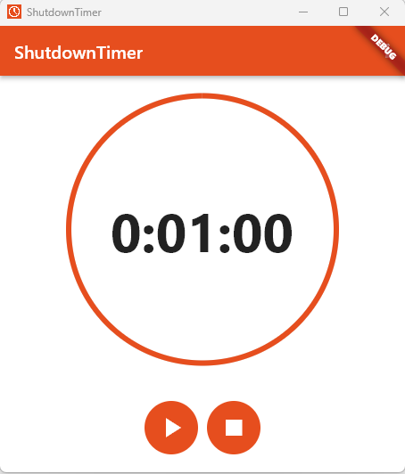

# ShutdownTimer

With "ShutdownTimer" you can set a timer after which your Windows PC is automatically shut down.
This application is only available for Windows.

### Screenshots:

## Getting Started

Download the latest Setup.exe file from releases and execute it.
Then follow the instructions.

[Go to releases](https://github.com/felixApps/ShutdownTimer/releases "This link leads directly to releases.")